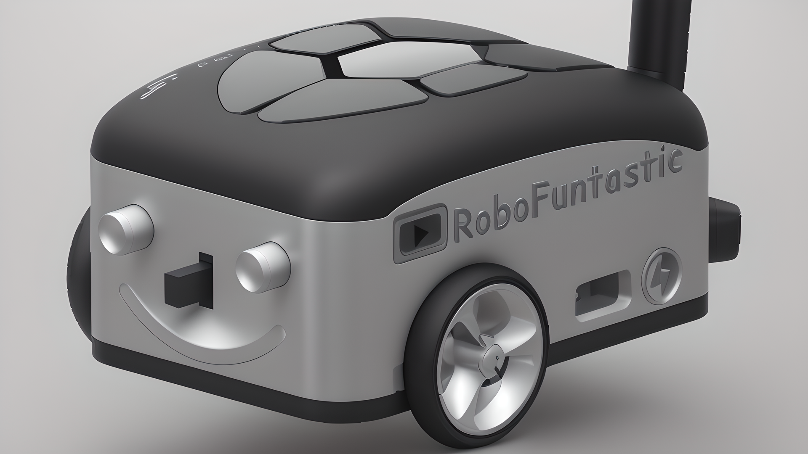

# Lineturtle ROS2 Package

Welcome to the Lineturtle ROS2 package repository! Lineturtle is an exciting project by RoboFuntastic that lets you build and control your very own drawing robot using ROS2 and MicroROS. This repository contains all the necessary code, resources, and instructions to get you started on this creative and educational journey.

[
](https://www.youtube.com/@RoboFuntastic)
## Features

- `/servo`: Control the servo for marker placement on the drawing surface.
- `/LEDs`: Manage the LEDs mounted on the robot.
- `/left_motor_ticks` and `/right_motor_ticks`: Get motor encoder values for left and right wheels.
- `/battery`: Monitor the battery level of the robot.
- `/cmd_vel`: Control the movement of the robot.

## Getting Started

Follow these steps to get started with your Lineturtle robot:
1. Go to your workspace:
   ```shell
   cd ros2_ws/src/
   
2. Clone this repository to your ROS2 workspace:
   ```shell
   git clone https://github.com/robofuntastic/lineturtle.git
3. Clone teleop_twist_joy repository (becuse lineturtle depends on the package) to your ROS2 workspace:
   ```shell
   git clone https://github.com/ros2/teleop_twist_joy.git -b foxy
4. Clone micro-ROS-Agent repository (becuse lineturtle depends on the package) to your ROS2 workspace:
   ```shell
   git clone https://github.com/micro-ROS/micro-ROS-Agent.git -b foxy
5. Build the ROS2 package and install dependencies:
   ```shell
   cd  ..
   rosdep install --from-paths src --ignore-src -r -y
   colcon build --symlink-install
   source install/local_setup.bash
6. Edit the config file /teleop_twist_joy/config/xbox.config.yaml, clear it and paste this
   ```shell
   teleop_twist_joy_node:
     ros__parameters:
       axis_linear: # right thumb stick vertical
         x: 4
       scale_linear:
         x: 0.15
       scale_linear_turbo:
         x: 0.3
       axis_angular: # right thumb stick horizontal
         yaw: 3
       scale_angular:
         yaw: 0.2
       scale_angular_turbo:
         yaw: 0.4
       enable_button: 6 # Left trigger button
       enable_turbo_button: 4 # left trigger button
7. 3D print the robot body using these [STL files](https://github.com/robofuntastic/lineturtle/tree/main/CAD%20%26%203D%20Printing).
8. Gather all the components and configure your robot's hardware and connections as described in the [guide](https://github.com/robofuntastic/lineturtle/blob/main/circuit%20%26%20components/LineTurtle%20Circuit%20Diagram.pdf).
9. Upload the [microros sketch](https://github.com/robofuntastic/lineturtle/blob/main/esp32_microros/lineturtle_esp32_microros/lineturtle_esp32_microros.ino) to ESP32.
10. Launch the lineturtle robot
   ```ros2 launch lineturtle lineturtle_launch.py```

## Contributing
We welcome contributions and suggestions from the community! If you find issues, want to suggest enhancements, or contribute to the codebase, please check out [ROS Discourse](https://discourse.ros.org/t/lineturtle-drawing-robot-based-on-esp32-microros-and-ros-2-by-robofuntastic/32940).

## License
This project is licensed under the MIT License.

Unlock the world of robotics, creativity, and learning with Lineturtle by RoboFuntastic. Start building and exploring today!

## [RoboFuntastic YouTube Channel](https://www.youtube.com/@RoboFuntastic)
## Udemy Course
## [ROS Discourse Community](https://discourse.ros.org/t/lineturtle-drawing-robot-based-on-esp32-microros-and-ros-2-by-robofuntastic/32940)
